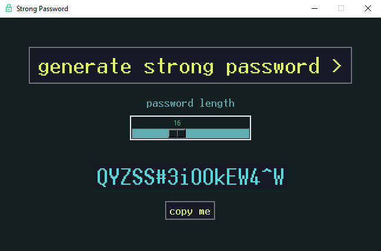

# Strong Password - a simple password generator

Strong Password is a simple password generator written in Python. This was built as a personal project as I wanted to learn more about Python's built-in GUI.

# Features

- Strong password generation, consisting of randomised upper and lowercase letters, numbers, and special characters
- Customisable length
- Copy-to-clipboard function
- Interactive and colourful user interface

# Usage

- Simply run the main file, and use the slider to modify your password length (the default is 16)
- Click 'generate strong password'
- Click 'copy me' to retrieve the password

# To-do

- Custom taskbar icon
- Highlightable text